# TrackNTrain

TrackNTrain is a personal fitness tracking app designed to help users stay consistent, motivated, and goal-oriented in their fitness journey. Whether you're aiming to build muscle, lose weight, or simply stay active, TrackNTrain provides the tools to log your progress, set goals, and analyze your performance over time.

With a focus on both workout and nutrition tracking, the app allows users to record daily meals, weights, personal records, and fitness goals — all in one place. Built-in visualizations and intelligent insights help users understand trends and stay on track.

- Daily logging of weight, meals, and workouts
- Goal setting with progress tracking and deadlines
- Personal record tracking for each exercise
- Visual analytics and summaries for weight, nutrition, and performance
- AI-powered suggestions based on user data and trends on a per week basis

## Features

- **Daily Tracking**  
  Log and monitor:
  - Weight
  - Meals: Breakfast, Lunch, Dinner, Snacks
  - Personal Records (PRs) for exercises

- **Fitness Goals**  
  Set, update, and track goals with custom deadlines and target metrics.

- **Visual Insights**  
  View trends in weight, performance, and progress over time via in-app summaries.

- **Authentication**  
  - Email/Password login
  - Google Sign-In integration

- **Smart Suggestions**  
  AI-powered feedback on weight trends, diet consistency, and workout improvements.

- **Reminders & Notifications (Upcoming)**  
  Gentle nudges to log data and stay consistent with goals.

- **Design your custom full-body workouts**
  Design and customise the order of your workout by choosing from a list of exercises targeting all muscles of the body. Contains detailed information on how to perform , when not to perform and muscles targeted. Log your sets, reps and weights lifted.

- **Design your custom HIIT workouts**
  Design and customise your HIIT workouts by configuring work, rest duration and number of rounds to be performed. Built-in timer will help in performing and notifying the remaining time and the upcoming exercise.

- **Walking and jogging**
  Track you location using using GPS and visualise your walking route using Leaflets maps and polyfills. Measure data like distance covered, average speed and time elapsed.

- **Workout Logs**
  Every workout performed is logged in Firestore and will remain the same way for 90 days after which they are automatically cleaned up. Tap on the logs to view the metadata related to the workout and to straight away jump in and perform the workout again to prevent the hassle of configuring everything again.

- **Meal and weight logs**
  Log your everyday meals and weight data consistently to get graphical display per week.
  Each user is then allowed one request to the Gemini API to get a detailed analysis on their goals, logs and provides insights. 
  

TrackNTrain is more than just a fitness log — it's your digital coach, accountability partner, and progress journal.

# Flutter UI

The ```./trackntrain``` folder contains the client-side Flutter code. So far the app is built for android only. 

## Screenshots

<div style="display: flex; flex-wrap: wrap; gap: 10px; justify-content: center;">

  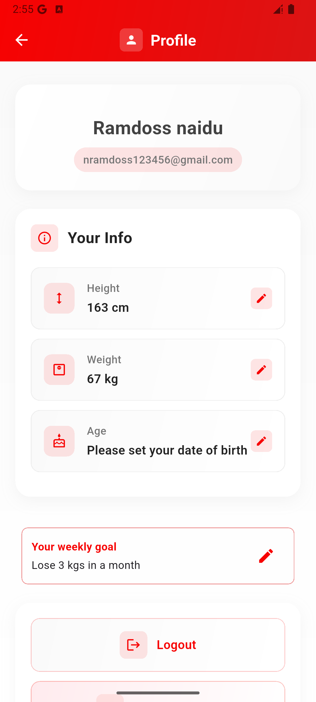
  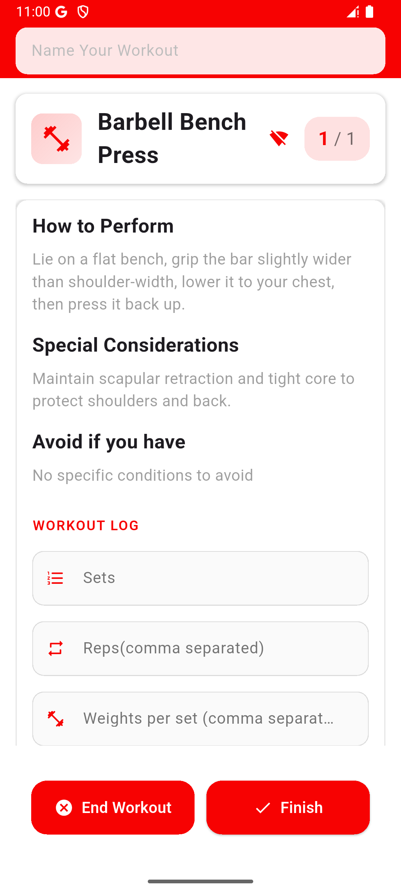
  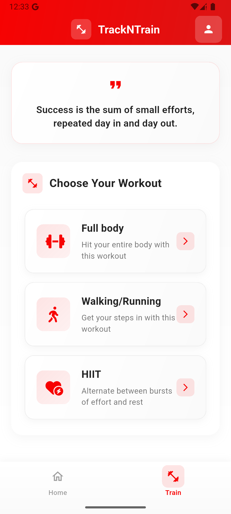
  
  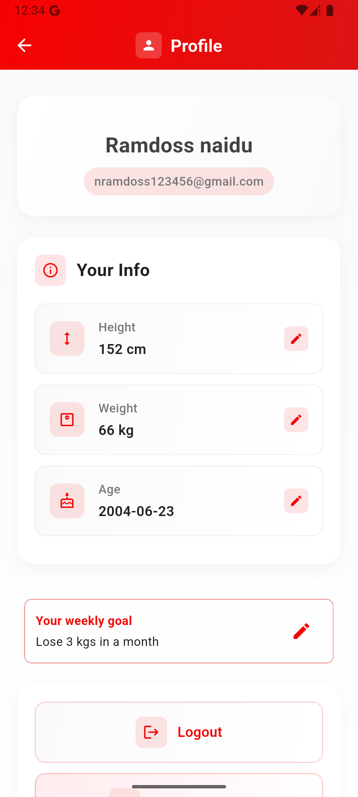
  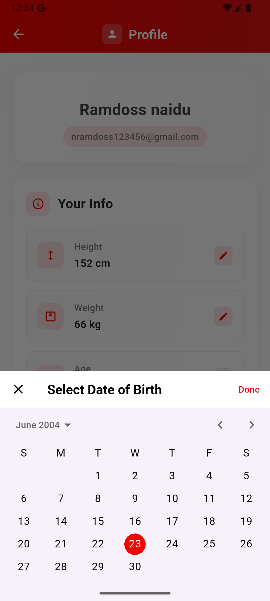
  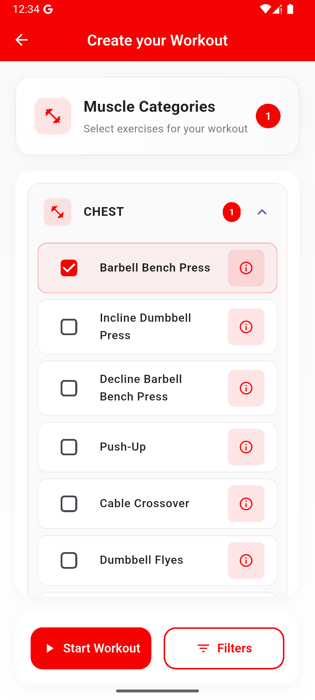
  
  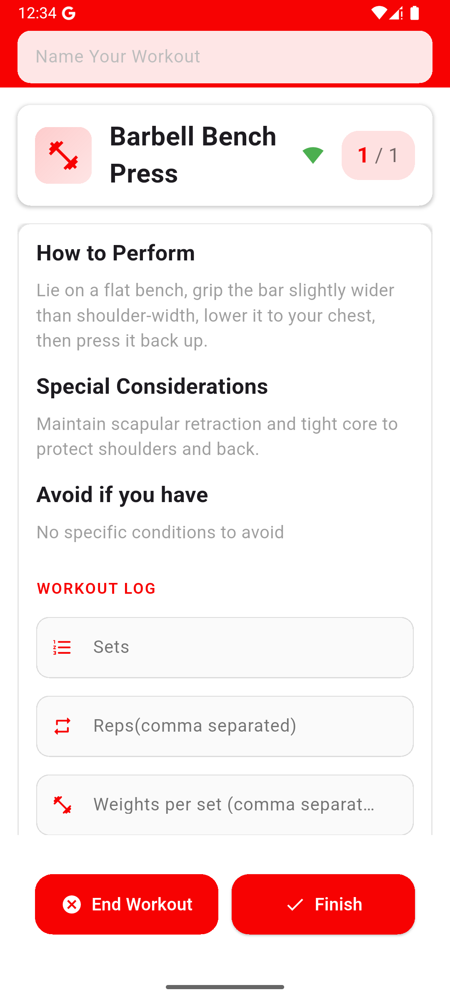
  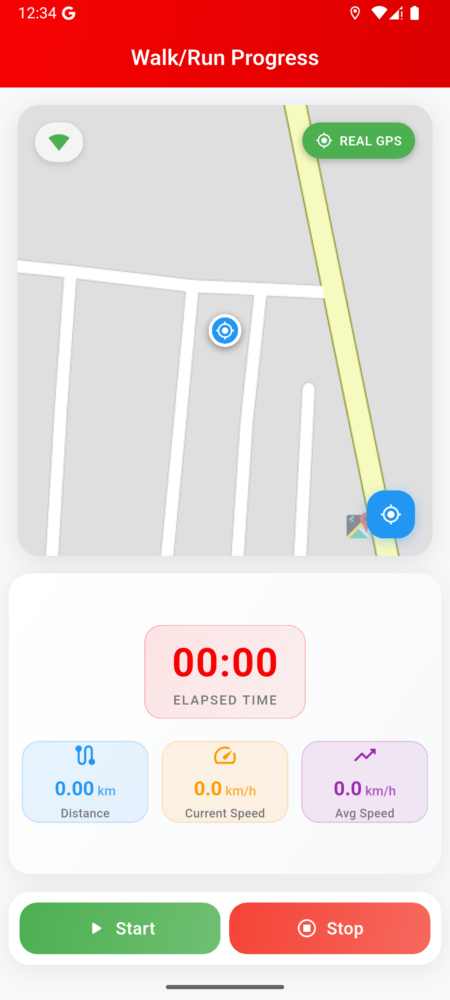
  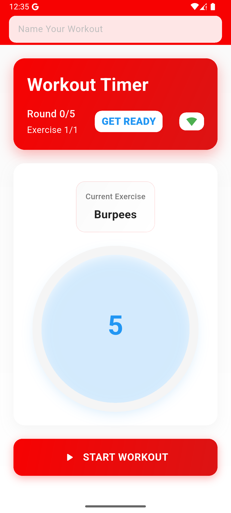
  
  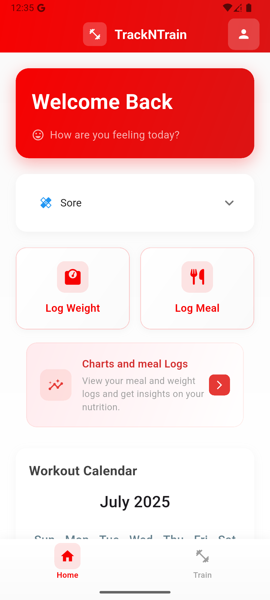
  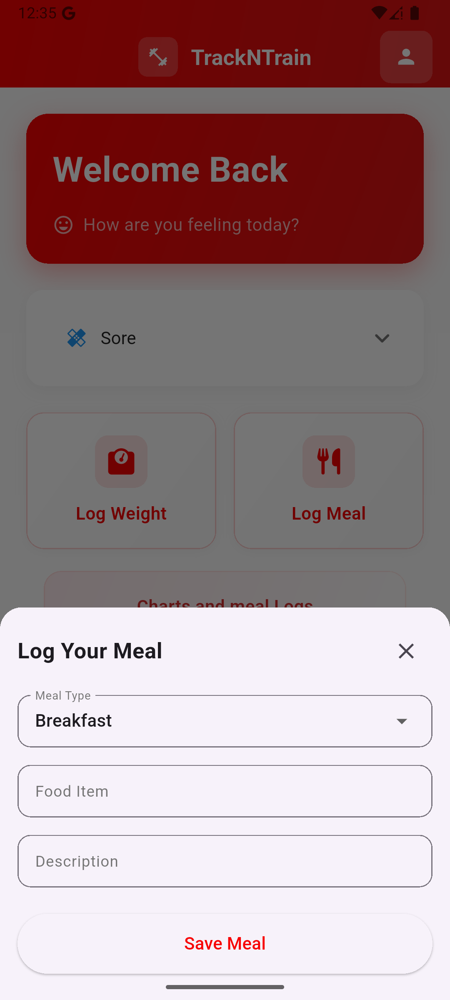

</div>


**Folder-structure**
- lib/
  - main.dart
  - config.dart
  - firebase_options.dart
  - pages/
    - all pages (screens)
    - ....
  - tabs/
    - all tabs
    - ....
  -components/
    - all mini component widgets
    - ....
  - utils/
    - auth_notifier.dart
    - auth_service.dart
    - db_util_funcs.dart
    - normal_auth_utils.dart
    - google_auth_utils.dart
    - ....
  - providers/
    - riverpod provider files
    - ...

## Shared Preferences

  Shared preferences is used to cache data in the mobile's storage to prevent unnecessary calls to firestore which is important as the app scales and MAU's increase
  SharedPreferences is used to store the following user-scoped or date-scoped values:

| Key Pattern                          | Purpose                                  |
|-------------------------------------|------------------------------------------|
| `hasWorkedOut_<userId>`             | Whether user worked out today            |
| `mood_<userId>_<YYYY-MM-DD>`        | Mood tracking for a specific date        |
| `goal_<userId>`                     | Current fitness goal for the week        |
| `goalWeek`                          | Week number in which goal was set        |
| `height_<userId>` / `weight_<userId>` / `age_<userId>` | Basic stats for analysis |
| `activeDates_<userId>`              | Dates user was active                    |
| `globalLastResetDate`              | Used to reset daily flags at midnight    |

---

### Utilities Provided

All SharedPreferences logic is abstracted under utility functions for modularity and readability. Here's an overview:

#### Daily Activity
- `hasWorkedOut()` / `setHasWorkedOut(bool)`
- `hasWorkedOutToday()` / `setHasWorkedOutToday(bool)`

#### Mood Tracking
- `setMood(String mood)`
- `getMood()` / `getTodaysMood()`
- `removeMood()`

#### Goal Management
- `setGoal(String goal)`
- `getGoal()` / `clearGoal()` / `clearWeeklyGoal()`

#### Active Days
- `setActiveDates(List<String>)`
- `getActiveDates()`

#### User Metrics
- `setHeight(double)` / `getHeight()`
- `setWeight(double)` / `getWeight()`
- `setAge(double)` / `getAge()`

#### Reset & Cleanup
- `checkAndResetDailyPrefs()`  
  Automatically clears daily flags (like mood/workout) from the previous day if the date has changed.
- `clearAllPrefs()`  
  Wipes all keys in SharedPreferences (admin/debug use).
- `clearCurrentUserPrefs()`  
  Clears only the current user's stored keys.
- `removePref(...)` and `removeCurrentUserPref(...)`  
  Safely remove any custom preference by key.

---

### Design Philosophy

- **User-Specific Keys**: Most data is stored per-user using UID suffixes to prevent clashes in shared environments.
- **Daily Reset Logic**: `checkAndResetDailyPrefs()` ensures data like mood and workout status is cleaned up daily.
- **Firebase + Local Sync**: Core persistent data remains in Firestore. SharedPreferences is used for fast access, offline UX, and temporary values.

---

- Sensitive or long-term data (like progress history, PR logs, etc.) should be stored in Firestore.
- SharedPreferences is purely local and should be treated as a performance layer, not a secure store.

## Firebase Setup
  TrackNTrain uses Firebase for:
- User Authentication (Email/Password and Google Sign-In)
- Firestore (for storing fitness-related data)
- Local caching via SharedPreferences (not part of Firebase, but complements it)

This guide explains how to set up Firebase for this Flutter app across Android and iOS, and how the `firebase_options.dart` and `google-services.json`/`GoogleService-Info.plist` files fit in.

---

### ⚙️ Step-by-Step Setup

#### 1. Create a Firebase Project

- Go to [Firebase Console](https://console.firebase.google.com/)
- Create a new project (or use an existing one)

---

#### 2. Register App on Firebase Console

##### Android:

- Click "Add App" → Select **Android**
- Use your Flutter app’s package name (e.g., `com.example.appname`)
- Download the `google-services.json` file
- Place it in your Flutter project under:

---

#### 3. Configure `firebase_options.dart` (Auto-Generated)

Install FlutterFire CLI (once globally):

```bash
dart pub global activate flutterfire_cli
```

then run

```flutterfire configure```

this wil auto-generate the ```firebase-options.dart``` file in the lib folder.

🔧 Platform-Specific Configs
Android
In android/build.gradle (top-level):

```gradle
classpath 'com.google.gms:google-services:4.3.15' // or latest
```

In android/app/build.gradle:

```gradle
plugins {
    id("com.android.application")
    id("com.google.gms.google-services")
    id("kotlin-android")
    id("dev.flutter.flutter-gradle-plugin")
}
```
in lib/ ```main.dart```

```dart
import 'package:firebase_core/firebase_core.dart';
import 'firebase_options.dart';

void main() async {
  WidgetsFlutterBinding.ensureInitialized();
  await Firebase.initializeApp(
    options: DefaultFirebaseOptions.currentPlatform,
  );
  runApp(MyApp());
}
```

## Authentication

TrackNTrain supports secure user authentication using **Firebase Auth**, with both **Email/Password** and **Google Sign-In** options. The authentication layer is built using a service/provider structure for clean separation of logic and UI.

---

### Supported Authentication Methods

- **Email & Password Sign-Up and Login**
- **Google Sign-In (via OAuth)**
- **Account Deletion**
- **Sign-Out**
- **Auth State Listening** for real-time session handling

---

### File Structure (Authentication Logic)

| File                                         | Purpose                                      |
|----------------------------------------------|----------------------------------------------|
| `utils/auth_service.dart`                    | Base Firebase Auth wrapper (`FirebaseAuth.instance`) |
| `utils/auth_notifier.dart`                   | `ChangeNotifier` that tracks and updates auth state |
| `utils/normal_auth_utils.dart`               | Functions for email/password sign-up and login |
| `utils/google_auth_utils.dart`               | Google OAuth login logic                      |

---

### Auth State Management

The app uses a custom **`AuthNotifier`** class that listens to `FirebaseAuth.instance.authStateChanges()` to automatically reflect authentication state changes in the UI.
This helps the app to automatically move to the login page in case the user's authentication state changes to not-authenticated.

```dart
class AuthNotifier extends ChangeNotifier {
  final StreamSubscription<User?> _authSubscription;
  User? _currentUser;

  AuthNotifier() {
    _currentUser = AuthService.currentUser;
    _authSubscription = AuthService.authStateChanges.listen((User? user) {
      _currentUser = user;
      notifyListeners();
    });
  }

  bool get isAuthenticated => _currentUser != null;
  User? get currentUser => _currentUser;
}
```

## Dio 

Dio is a package used to make HTTP requests to our external APIs to get responses. In this case our external APIs is nothing but the serverless backend hosted through Firebase Cloud Functions.
We have 2 endpoints

1. To handle the AI insight generation.
2. To handle user account deletion.

## Env Vars

When the app is set up for production it is not safe to store sensitive data like our endpoints to cloud functions here as they can be abused. Hence we write a config file like this. This way we pass the actual URLs during the build process where we create the ```.apk``` file for deployment to playstore.

```dart
class AppConfig{
  static const String aiUrl=String.fromEnvironment(
    'AI_INSIGHTS_URL',
    defaultValue: 'https://trackntrain-ai-insights.onrender.com/ai/meal-suggestion',
  );
  static const String deletionUrl=String.fromEnvironment(
    'USER_DELETION_URL',
    defaultValue: 'https://trackntrain-ai-insights.onrender.com/ai/delete-user',
  );
}
```

# Cloud Firestore rules
It is important to set rules for cloud firestore to prevent unauthorised access and writes and deletes. The app uses rules to ensure that any write, read, update and delete is performed only if authenticated and if the user requesting the service is the same as the document's owner. 

# Backend

Our backend just consists of serverless Firebase Cloud functions

A serverless Firebase Functions backend for a comprehensive fitness tracking application that provides AI-powered insights based on user health data.

## Overview

This backend handles user fitness data management, automated daily log creation, user account deletion, and AI-powered weekly insights generation using Google's Gemini AI model.

## Features

### Core Functionality
- **Automated Daily Log Creation**: Scheduled function that creates daily meta logs for all users
- **User Data Deletion**: Complete user data cleanup across all collections
- **AI-Powered Insights**: Weekly fitness insights using Google Gemini AI

### Data Management
- User meta logs (mood, weight, workout status)
- Meal tracking and analysis
- Workout records (full body, HIIT, walking)
- Automatic data expiration (90-day TTL)


# Fitness Tracker Backend

A serverless Firebase Functions backend for a comprehensive fitness tracking application that provides AI-powered insights based on user health data.

## Overview

This backend handles user fitness data management, automated daily log creation, user account deletion, and AI-powered weekly insights generation using Google's Gemini AI model.

## Features

### Core Functionality
- **Automated Daily Log Creation**: Scheduled function that creates daily meta logs for all users
- **Spot Log Creation**: Manual endpoint for creating individual user logs
- **User Data Deletion**: Complete user data cleanup across all collections
- **AI-Powered Insights**: Weekly fitness insights using Google Gemini AI

### Data Management
- User meta logs (mood, weight, workout status)
- Meal tracking and analysis
- Workout records (full body, HIIT, walking)
- Automatic data expiration (90-day TTL)

## API Endpoints

### GET /helloWorld
Basic health check endpoint that returns a simple greeting message.

### POST /handleDeletion
Completely removes all user data from the system including meta logs, meal logs, workout records, and user document.
Uses the user's ```idToken``` to determine whether the person is authenticated and is the same person requesting the delete.

**Response:**
- `200`: All data deleted successfully
- `400`: Missing userId
- `500`: Error during deletion

### POST /getAIInsights
Generates personalized AI-powered fitness insights based on the user's previous week's data.
Uses the user's ```idToken``` to determine whether the person is authenticated and is the same person requesting the insight.

**Response:**
```json
{
  "prompt": "string",
  "aiResponse": "string",
  "weightSummary": {
    "min": "number",
    "max": "number",
    "average": "number",
    "message": "string"
  },
  "moodSummary": {
    "energetic": "string",
    "sore": "string", 
    "cannot": "string",
    "message": "string"
  },
  "mealSummary": {
    "message": "string",
    "mostFrequentFoods": "object"
  },
  "userGoal": "string"
}
```

## Scheduled Functions

### metaLogCreation
Runs daily at midnight (Asia/Kolkata timezone) to create meta logs for all registered users.

**Schedule:** `0 0 * * *` (Daily at midnight)

**Features:**
- Processes users in batches of 500
- Carries forward previous day's weight data
- Sets 90-day expiration for automatic cleanup
- Handles errors gracefully with retry logic

## Configuration

### Environment Variables
- `GEMINI_API_KEY`: Secret for Google Gemini AI API access

### Firebase Settings
- **Region**: asia-south1
- **Memory**: 256MiB
- **Timeout**: 300 seconds (AI endpoint), 180 seconds (deletion)
- **Timezone**: Asia/Kolkata

## Data Models

### Meta Log Document
```typescript
{
  userId: string,
  date: string,
  createdAt: Timestamp,
  updatedAt: Timestamp,
  hasWorkedOut: boolean,
  mood: "energetic" | "sore" | "cannot" | null,
  weight: number,
  sleep?: number,
  expireAt: Timestamp
}
```

### Meal Document
```typescript
{
  userId: string,
  breakfast?: {
    mealName: string,
    description?: string,
    mealType: string
  },
  lunch?: {
    mealName: string,
    description?: string,
    mealType: string
  },
  dinner?: {
    mealName: string,
    description?: string,
    mealType: string
  },
  snacks?: Array,
  createdAt: Timestamp,
  updatedAt?: Timestamp,
  expireAt?: Timestamp
}
```

## Data Processing Functions

The backend includes specialized preprocessing functions that transform raw user data into meaningful insights before AI analysis:

### preprocessWeights()
Analyzes weekly weight data to calculate:
- Minimum and maximum weights
- Average weight for the period
- Weight change from start to end of week
- Weight fluctuation patterns

### preprocessMood()
Processes mood entries to determine:
- Distribution across three states: energetic, sore, cannot workout
- Percentage breakdown of each mood state
- Dominant mood pattern identification
- Weekly mood trend analysis

### preprocessMeals()
Transforms meal logging data into structured summaries:
- Categorizes meals by type (breakfast, lunch, dinner, snacks)
- Identifies most frequently consumed foods
- Generates comprehensive meal descriptions
- Calculates food consumption frequency patterns

These functions ensure the AI receives clean, structured data for generating accurate and personalized insights.


## AI Integration

The system uses Google's Gemini 2.0 Flash model to generate personalized fitness insights. The AI analyzes:

- **Weight Trends**: Weekly weight changes and fluctuations
- **Mood Patterns**: Distribution of energetic, sore, and unable-to-workout days
- **Meal Analysis**: Food consumption patterns and frequency
- **Goal Alignment**: Personalized advice based on user's fitness goals

The AI generates conversational, coach-like feedback under 700 words, avoiding generic advice and providing specific, actionable insights.

This is what a sample prompt looks like 

```txt
Weight
You have lost 2 kg since last week.
Your weight has fluctuated between 64 kg and 68 kg.

Mood
The 3 possible mood states are: energetic, sore, and cannot work out.
You have been feeling sore for about 2 out of the 3 logged days of the week.

Meals
Here's what you ate this week:

Breakfasts
Whey Protein Shake and Bananas — 500 ml
Oatmeal — 200 gms
Oatmeal — 100 gms

Lunches
BBQ chicken — 250 gms
Rice and sambar — 1 bowl
Biriyani — 1 plate

Dinners
Idly — 3 nos
Rotis and Channa — 3 nos
Idly — 3 nos

Snacks
Chicken 65 — 100 gms
Milkshake — 200 ml

Most frequently consumed items:
Idly (2 times), Oatmeal (2 times), Whey Protein Shake and Bananas (1 time)

Goal
I want to lose 2 kgs of weight.
```

 **Sample Response**
 ```txt
Hey!

Really awesome work this week — you've already hit your weight loss goal by dropping 2 kg. That’s a solid achievement and it shows you’ve been putting in the effort.

I did notice you’ve been feeling sore on most of the logged days. That’s often a sign your workouts are pushing you, which is good, but it also means your recovery needs some attention. Make sure you’re stretching well, maybe try a light walk or some mobility work on your rest days. And don’t be afraid to dial things back slightly if the soreness is lingering — recovery is part of progress.

Your breakfasts are looking great — the oatmeal and protein shakes are exactly the kind of fuel your body needs in the mornings. Lunch was a bit all over the place this week, so if possible, try to bring a bit more balance there — aim for some protein, veggies, and a complex carb in each meal. Dinner’s been solid, but adding a side of greens or fiber would really round it out.

As for snacks, the milkshake isn’t bad, but Chicken 65 — while tasty — is a little heavy on the fats. Maybe swap it once in a while for something lighter like fruit, Greek yogurt, or a handful of nuts.

Two things I’d really recommend focusing on this coming week:
First, prioritize your recovery — soreness is a signal. Even just 15 minutes of stretching, foam rolling, or a gentle walk can make a big difference.
Second, don’t forget to hydrate — especially with the kind of output you’re giving. Water plays a bigger role in recovery and energy than most people realize.

You’ve clearly got the motivation — just keep refining the process now. Really proud of how far you've already come. Let’s keep that momentum going.
```


## Error Handling

All endpoints include comprehensive error handling with:
- Input validation
- Firestore operation error catching
- AI API error management
- Detailed logging for debugging
- Appropriate HTTP status codes

## Security

- Firebase Authentication integration
- Input sanitization
- Secret management for API keys
- Batch operation limits for data safety


## Deployment 

Deploy your cloud functions using this command

```bash
firebase deploy --only functions: <name1> <name2>
```

While doing so firebase will prompt you for the SECRET (Gemini API Key) which will be stored in the Google Cloud Secrets Manager in a safe manner.

Any dependencies related to the cloud functions must be installed inside the ```/functions``` folder and not the root folder of the ```backend```.


# Future improvements

- Enabling push notifications for regular reminders and gamification.
- Inclusion of social features to create a more engaged community.
- Addition of exercise preview videos or GIFs to show how it is to be performed.
- Adding a ML model to verify form and correct the users to prevent injuries.
- Offline persistence and pushing to firestore when connected to internet later.

